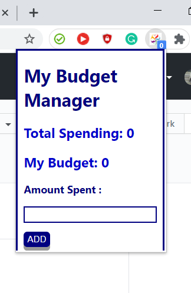

# BudgetExtension
It is a chrome extension for managing budget. the user can set up a budget limit and can add the amounts they have spent. Adding expenditure while shopping online is the cherry on top!

The user will receive a notification if they exceed the Budget limit they have set.

There is another functionality that the user can reset their total spending whenever they want and shall receive a notification when it is reset!
Iteresting isn't it?? :blush:

## ScreenShots

